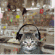

<html>
    <head>
        
    </head>
    <body>
           
            <h1>✧(•‿•) <i><b>Jen's Homepage</b></i> (•‿•)✧</h1>
         <h2>Header 2</h2>
         <h3>Header 3</h3>
         
hello this is a sentence   hellooooooooo sentence

           

    </body>
</html>
